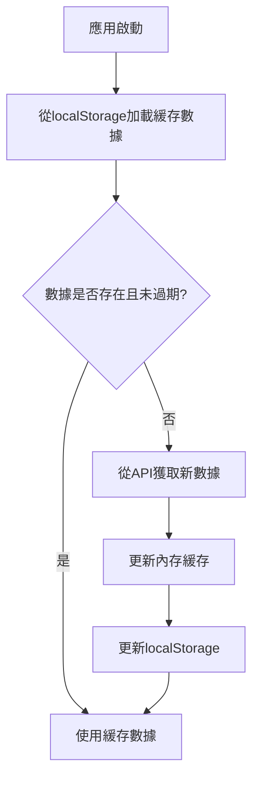
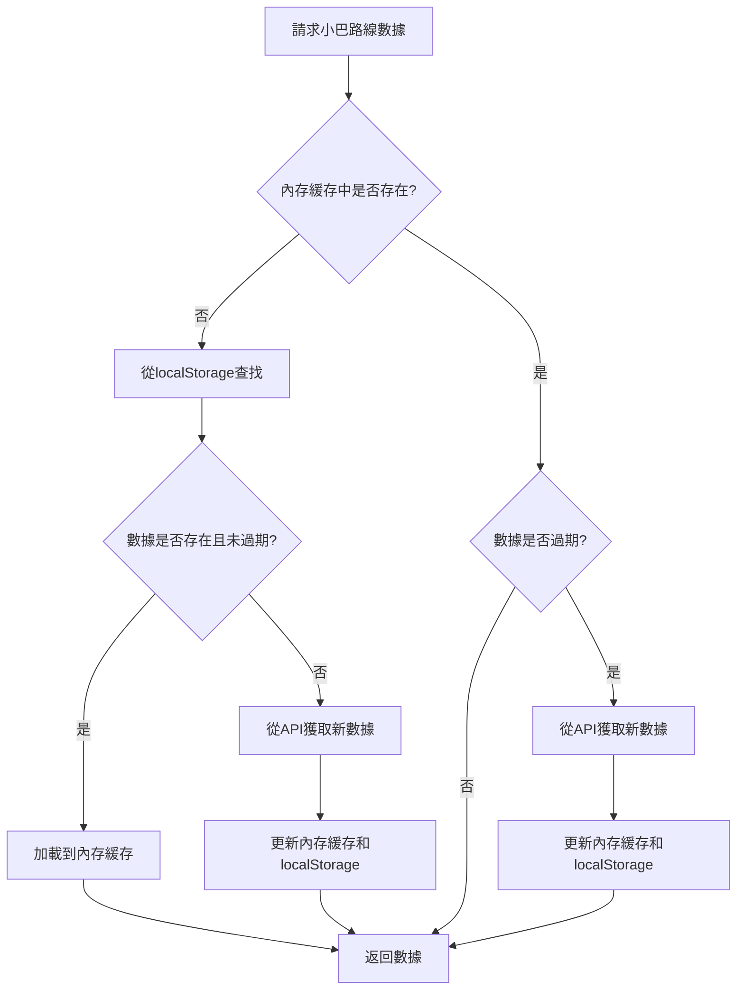

# 數據同步機制設計

## 目標
確保持久化存儲在 localStorage 中的小巴數據保持新鮮，同時提供良好的用戶體驗。

## 數據新鮮度策略

### 1. 緩存過期時間設置
- **小巴路線數據**：7天
  - 路線號碼、起點和終點等基本信息很少變更
  - 7天的緩存時間可以在減少API請求的同時保持數據相對新鮮

- **小巴站點數據**：1小時
  - 站點信息可能會有臨時變更（如道路施工）
  - 1小時的緩存時間可以在減少API請求的同時保持數據較為新鮮

- **小巴到站時間**：30秒
  - 到站時間實時變化
  - 30秒的緩存時間可以減少API請求，同時保持數據的實時性

### 2. 數據驗證機制

#### 2.1 應用啟動時驗證
```typescript
// 在應用啟動時檢查數據新鮮度
const checkDataFreshness = () => {
  const routes = cacheManager.get<MinibusRoute[]>(MINIBUS_CACHE_KEYS.ROUTES);
  if (routes) {
    const cacheItem = cacheManager.getCacheItem<MinibusRoute[]>(MINIBUS_CACHE_KEYS.ROUTES);
    if (cacheItem) {
      const age = Date.now() - cacheItem.timestamp;
      // 如果數據超過3天，標記為需要更新
      if (age > 3 * 24 * 60 * 60 * 1000) {
        console.log('Minibus routes data is older than 3 days, consider refreshing');
        // 可以觸發後台更新
        refreshMinibusDataInBackground();
      }
    }
  }
};
```

#### 2.2 數據完整性檢查
```typescript
// 檢查數據完整性
const validateMinibusData = (routes: MinibusRoute[]) => {
  // 檢查是否包含必要的字段
  return routes.every(route => 
    route.routeId && 
    route.routeNo && 
    route.orig_tc && 
    route.dest_tc
  );
};
```

### 3. 數據更新策略

#### 3.1 被動更新
- 當用戶請求數據時，如果緩存已過期則從API獲取新數據

#### 3.2 主動更新
- 在應用啟動時檢查數據新鮮度
- 定期在後台更新數據（如果應用保持運行）

#### 3.3 用戶觸發更新
- 提供手動刷新按鈕
- 在設置面板中提供數據管理選項

### 4. 數據同步流程

#### 4.1 應用啟動流程


#### 4.2 數據請求流程


### 5. 錯誤處理和降級

#### 5.1 API請求失敗處理
```typescript
export const getMinibusRoutes = async (forceRefresh = false): Promise<MinibusRoute[]> => {
  // 先嘗試從緩存獲取
  if (!forceRefresh) {
    const cached = cacheManager.get<MinibusRoute[]>(MINIBUS_CACHE_KEYS.ROUTES);
    if (cached) return cached;
  }
  
  try {
    // 從API獲取數據
    const routes = await fetchMinibusRoutesFromAPI();
    
    // 驗證數據完整性
    if (validateMinibusData(routes)) {
      // 保存到緩存
      cacheManager.set(
        MINIBUS_CACHE_KEYS.ROUTES,
        routes,
        { maxAge: 7 * 24 * 60 * 60 * 1000 } // 7天
      );
      return routes;
    } else {
      console.warn('Invalid minibus data received from API');
      // 如果有緩存數據，即使過期也返回緩存數據
      const cached = cacheManager.get<MinibusRoute[]>(MINIBUS_CACHE_KEYS.ROUTES);
      if (cached) {
        console.log('Returning expired cached data due to API data validation failure');
        return cached;
      }
      throw new Error('No valid data available');
    }
  } catch (error) {
    console.error('Failed to fetch minibus routes from API:', error);
    // 如果有緩存數據，即使過期也返回緩存數據
    const cached = cacheManager.get<MinibusRoute[]>(MINIBUS_CACHE_KEYS.ROUTES);
    if (cached) {
      console.log('Returning expired cached data due to API failure');
      return cached;
    }
    throw error;
  }
};
```

#### 5.2 localStorage 操作失敗處理
```typescript
class CacheManager {
  set<T>(key: string, data: T, config?: Partial<CacheConfig>): void {
    // ... 內存緩存操作 ...
    
    // 保存到 localStorage
    try {
      localStorage.setItem(getLocalStorageKey(key), JSON.stringify(cacheItem));
    } catch (error) {
      // 處理 localStorage 空間不足等錯誤
      if (error instanceof DOMException && error.name === 'QuotaExceededError') {
        console.warn('localStorage quota exceeded, clearing cache');
        this.clear();
      } else {
        console.error('Failed to save cache to localStorage:', error);
      }
    }
  }
}
```

### 6. 用戶體驗優化

#### 6.1 加載狀態指示
- 在數據加載時顯示適當的加載指示器
- 區分首次加載和後續請求

#### 6.2 離線支持
- 在離線時優先使用緩存數據
- 提供離線可用性指示

#### 6.3 數據刷新反饋
- 在後台刷新數據時提供視覺反饋
- 在數據更新完成後通知用戶

### 7. 監控和分析

#### 7.1 性能指標
- 緩存命中率
- 數據加載時間
- API請求頻率

#### 7.2 數據質量指標
- 數據新鮮度（平均數據年齡）
- 數據完整性檢查失敗率
- 錯誤率

#### 7.3 用戶行為指標
- 數據手動刷新頻率
- 離線使用頻率
- 數據加載失敗後的用戶行為

### 8. 安全考慮

#### 8.1 數據驗證
- 在存儲和讀取數據時進行驗證
- 防止惡意數據注入

#### 8.2 數據清理
- 定期清理過期數據
- 防止 localStorage 被填滿

### 9. 可擴展性考慮

#### 9.1 數據分片
- 對於大量數據，考慮分片存儲
- 按區域或類型分組存儲

#### 9.2 壓縮存儲
- 對於重複數據，考慮壓縮存儲
- 使用更高效的序列化格式

### 10. 測試策略

#### 10.1 單元測試
- 測試緩存過期邏輯
- 測試數據驗證功能
- 測試錯誤處理機制

#### 10.2 集成測試
- 測試完整的數據加載流程
- 測試應用重啟後的數據恢復
- 測試離線場景下的行為

#### 10.3 用戶體驗測試
- 測試不同網絡條件下的表現
- 測試大量數據下的性能
- 測試錯誤場景下的用戶體驗