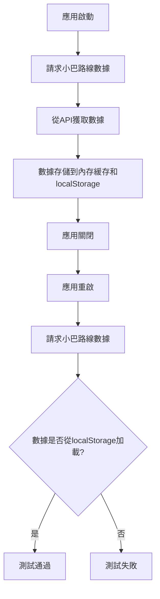

# 小巴數據持久化存儲測試計劃

## 目標
驗證將小巴靜態數據（如路線號碼、起點和終點）下載到本地存儲的功能是否正常工作，並確保數據同步機制能保持數據新鮮度。

## 測試環境

### 1. 瀏覽器兼容性
- Chrome (最新版本)
- Firefox (最新版本)
- Safari (最新版本)
- Edge (最新版本)

### 2. 設備類型
- 桌面瀏覽器
- 移動瀏覽器
- PWA 應用

### 3. 網絡條件
- 正常網絡連接
- 慢速網絡連接
- 離線狀態

## 測試策略

### 1. 單元測試

#### 1.1 CacheManager 單元測試
- 測試 localStorage 讀寫功能
- 測試數據過期處理
- 測試內存和 localStorage 數據一致性
- 測試錯誤處理（如 localStorage 空間不足）

#### 1.2 MinibusApi 單元測試
- 測試緩存命中和未命中情況
- 測試強制刷新功能
- 測試數據驗證功能
- 測試錯誤處理機制

### 2. 集成測試

#### 2.1 數據持久化測試

#### 2.2 數據新鮮度測試
- 測試數據過期後是否正確從API獲取新數據
- 測試應用啟動時的數據新鮮度檢查
- 測試手動刷新功能

#### 2.3 錯誤處理測試
- 測試API請求失敗時的行為
- 測試localStorage操作失敗時的行為
- 測試數據驗證失敗時的行為

### 3. 用戶體驗測試

#### 3.1 性能測試
- 首次加載時間
- 後續請求響應時間
- localStorage 讀寫性能

#### 3.2 離線使用測試
- 離線狀態下數據可用性
- 網絡恢復後的數據同步

#### 3.3 用戶界面測試
- 加載狀態指示
- 錯誤信息顯示
- 數據刷新反饋

## 測試用例

### 1. 基本功能測試

| 用例ID | 用例描述 | 預期結果 |
|--------|----------|----------|
| TC001 | 應用首次啟動，請求小巴路線數據 | 數據從API獲取並存儲到localStorage |
| TC002 | 應用重啟，請求小巴路線數據 | 數據從localStorage加載 |
| TC003 | 數據未過期，請求小巴路線數據 | 數據從localStorage加載 |
| TC004 | 數據已過期，請求小巴路線數據 | 數據從API獲取並更新localStorage |

### 2. 數據同步測試

| 用例ID | 用例描述 | 預期結果 |
|--------|----------|----------|
| TC005 | 應用啟動時檢查數據新鮮度 | 舊數據觸發後台更新 |
| TC006 | 手動刷新小巴數據 | 數據從API獲取並更新localStorage |
| TC007 | API請求失敗時使用緩存數據 | 即使過期也返回緩存數據 |
| TC008 | 數據驗證失敗時使用緩存數據 | 即使過期也返回緩存數據 |

### 3. 錯誤處理測試

| 用例ID | 用例描述 | 預期結果 |
|--------|----------|----------|
| TC009 | localStorage 空間不足 | 清理緩存並記錄錯誤 |
| TC010 | localStorage 不可用 | 回退到原始內存緩存 |
| TC011 | API 返回無效數據 | 使用緩存數據並記錄錯誤 |
| TC012 | 網絡離線 | 使用緩存數據並顯示離線提示 |

### 4. 性能測試

| 用例ID | 用例描述 | 預期結果 |
|--------|----------|----------|
| TC013 | 首次加載小巴數據 | 加載時間在可接受範圍內 |
| TC014 | 後續請求小巴數據 | 響應時間在可接受範圍內 |
| TC015 | localStorage 讀寫性能 | 操作時間在可接受範圍內 |
| TC016 | 大量數據存儲 | 不影響應用性能 |

## 驗證標準

### 1. 功能驗證
- [ ] 小巴路線數據能夠正確存儲到localStorage
- [ ] 應用重啟後能夠從localStorage加載數據
- [ ] 數據過期後能夠正確從API獲取新數據
- [ ] 數據驗證失敗時能夠正確處理

### 2. 性能驗證
- [ ] 首次加載時間不超過10秒
- [ ] 後續請求響應時間不超過1秒
- [ ] localStorage 讀寫操作時間不超過100毫秒
- [ ] 應用內存使用量在合理範圍內

### 3. 用戶體驗驗證
- [ ] 加載狀態有適當的指示
- [ ] 錯誤信息清晰易懂
- [ ] 離線狀態下有適當的提示
- [ ] 數據刷新有視覺反饋

### 4. 兼容性驗證
- [ ] 在主流瀏覽器中正常工作
- [ ] 在移動設備上正常工作
- [ ] 在PWA模式下正常工作
- [ ] 在不同網絡條件下正常工作

## 測試工具

### 1. 自動化測試工具
- Jest 用於單元測試
- Cypress 用於集成測試
- Lighthouse 用於性能測試

### 2. 手動測試工具
- 瀏覽器開發者工具
- 網絡模擬工具
- localStorage 調試工具

## 測試報告

### 1. 測試結果記錄
- 記錄每個測試用例的執行結果
- 記錄測試過程中發現的問題
- 記錄性能指標

### 2. 問題跟踪
- 記錄發現的問題
- 記錄問題的嚴重程度
- 記錄問題的修復狀態

### 3. 性能分析
- 分析緩存命中率
- 分析數據加載時間
- 分析API請求頻率
- 分析localStorage 使用量

## 風險評估

### 1. 技術風險
- localStorage 空間限制可能影響功能
- 瀏覽器兼容性問題可能影響用戶體驗
- 數據同步機制可能導致數據不一致

### 2. 業務風險
- 數據過期可能影響用戶體驗
- 錯誤處理不當可能導致應用崩潰
- 性能問題可能影響用戶滿意度

### 3. 緩解措施
- 實現智能清理機制以處理localStorage 空間限制
- 進行充分的瀏覽器兼容性測試
- 實現完善的錯誤處理和降級機制
- 定期監控和優化性能指標

## 後續改進

### 1. 持續監控
- 監控緩存命中率
- 監控數據加載時間
- 監控錯誤率

### 2. 用戶反饋
- 收集用戶對加載速度的反饋
- 收集用戶對數據準確性的反饋
- 收集用戶對離線體驗的反饋

### 3. 性能優化
- 根據監控數據優化緩存策略
- 根據用戶反饋優化數據加載流程
- 根據使用模式優化數據存儲結構